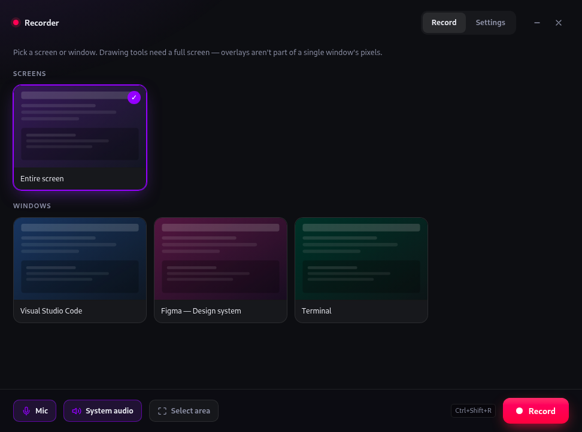
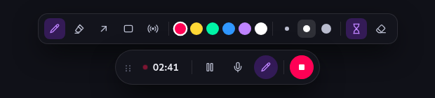
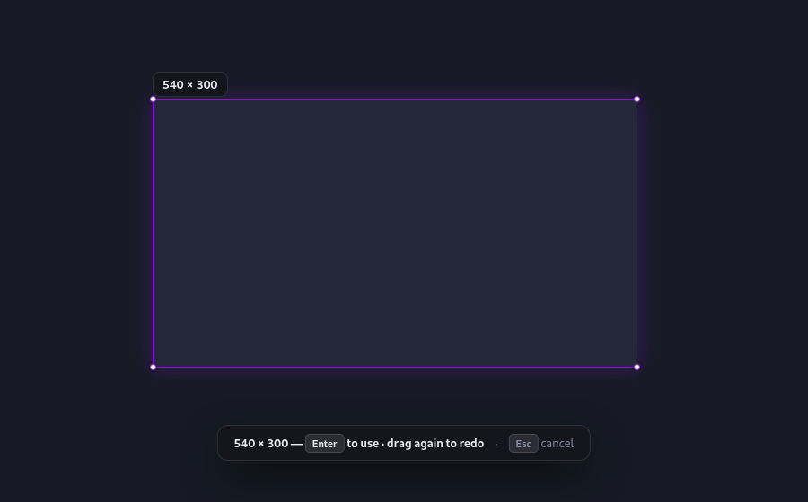
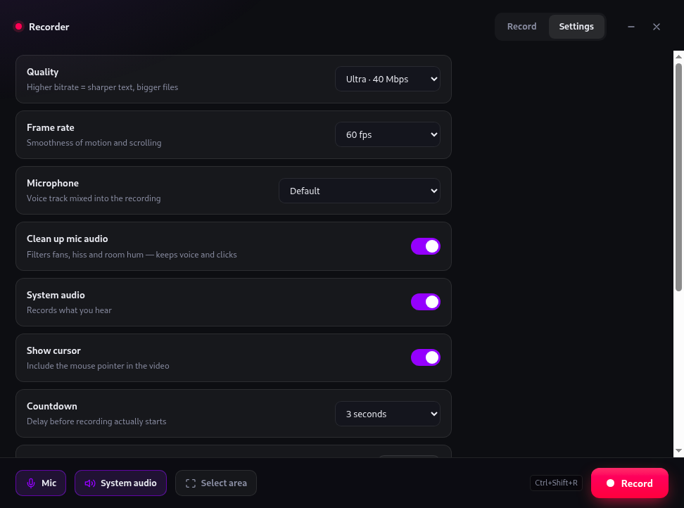

<div align="center">
  
  <h1>Recorder</h1>
  <p>Screen recorder with audio, a floating control bar, region capture and a drawing overlay.<br>
  Electron + <code>getDisplayMedia</code> → <code>MediaRecorder</code> → mp4 or webm.</p>
</div>



## What it does

- **Record a screen, a window, or a dragged region** — pick an area and the video is cropped to exactly that size
- **Audio** — microphone and system audio, mixed into one track, with noise suppression on by default
- **Floating control bar** — timer, pause/resume, mic mute, stop; drag it anywhere
- **Draw while recording** — pen, highlighter, arrow, rectangle, laser pointer, with strokes that fade away on their own
- **mp4 or webm** — mp4 (H.264/AAC) plays everywhere; webm (VP9/Opus) is smaller at the same quality
- **Quality up to 80 Mbps** at 60 fps — visually lossless for screen content
- **Global hotkeys** that work while the app is hidden

## The control bar

Appears when recording starts; the main window gets out of the way. The pen toolbar expands from it.



Hover the bar while a drawing tool is armed and the mouse is handed back to you, so stop and pause
always stay clickable.

## Region capture

Drag an area, confirm with <kbd>Enter</kbd>. The selection stays clear while everything else dims,
so you can see what you're about to record.



## Settings



## Install

Download the `.AppImage` from [releases](../../releases), then:

```bash
chmod +x Recorder-*.AppImage
./Recorder-*.AppImage
```

## Develop

```bash
npm install
npm start                        # run
npm run smoke                    # drive one real recording end-to-end; prints SMOKE PASS
npm run dist                     # build an AppImage into dist/
```

`npm start` may need `--no-sandbox --disable-gpu --in-process-gpu` on some setups (running as root,
or a machine whose GPU process can't reach the X display).

| File | What it is |
|---|---|
| `main.js` | windows, IPC, settings, hotkeys, file writing |
| `ui/index.html` + `app.js` | source picker, settings, preview — **the recording itself runs here** |
| `ui/bar.html` | floating control pill + pen toolbar |
| `ui/overlay.html` | transparent canvas for the pen |
| `ui/select.html` | drag-to-pick region overlay |

## Things that will bite you

- **The bar must stack above the overlay.** `rec:started` creates the overlay *first* so the bar
  lands on top, and hovering the bar hands the mouse back. Window stacking alone isn't enough on X11.
- **A transparent window still eats clicks.** The bar window is resized to fit its visible content
  (`bar:size`); any slack becomes an invisible dead zone the pen can't draw through.
- **The pen overlay only lands in the video if you record a whole screen**, not a single window —
  it's a separate window composited onto the display.
- **`MediaRecorder` omits the webm Duration header**, so players report `Infinity` and seeking breaks.
  `fix-webm-duration` patches the blob before saving. Don't remove it.
- **`setContentProtection(true)` hides the bar from the recording on Windows/macOS only.** Verified a
  no-op on Linux/X11 — drag the bar aside or hide it with the pen hotkey there.
- **System audio** is `audio: 'loopback'`. Works on Windows and Linux/PulseAudio. macOS has no
  loopback device — pick BlackHole (or similar) as the microphone instead.
- **Linux needs a real session bus for audio.** If `XDG_RUNTIME_DIR` is unset, PulseAudio won't
  connect and capture silently falls back to video-only.

### Why mp4 goes through ffmpeg

`MediaRecorder` here can't emit mp4 (`isTypeSupported('video/mp4…')` is false), so mp4 means:
record **H.264 inside a webm container**, then rewrap with a bundled `ffmpeg-static`. The video is
stream-copied (instant) and only Opus → AAC is re-encoded, which is cheap. If the video somehow
isn't H.264, it falls back to a real `libx264` encode. A failed conversion keeps the webm rather
than losing the recording.

`ffmpeg-static` must be in `asarUnpack` — a binary inside `app.asar` can't be executed.

### Why region capture uses a canvas

`getDisplayMedia` cannot crop to an arbitrary screen rect — there's no constraint for it, and Region
Capture (`track.cropTo`) only works against a DOM element in a captured *tab*. So a region recording
pumps the full-screen track through a `<canvas>` and records `canvas.captureStream()`. Full screen
and window capture stay on the direct path — don't route them through the canvas "for consistency",
it costs a draw per frame for nothing.

The draw loop uses `video.requestVideoFrameCallback`, **not** `requestAnimationFrame`: rAF stops when
the main window is hidden, which is exactly when recording happens.

## License

MIT
